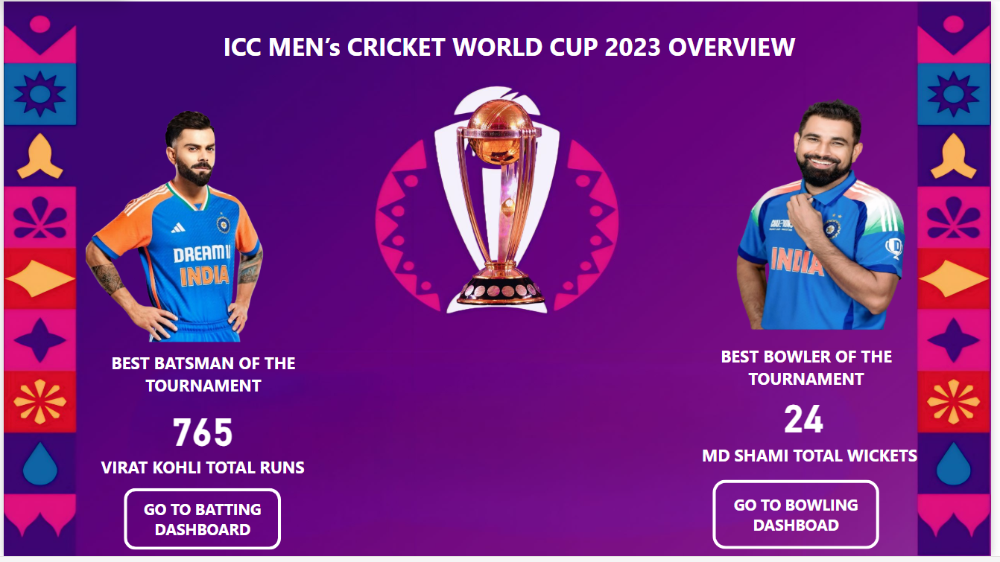
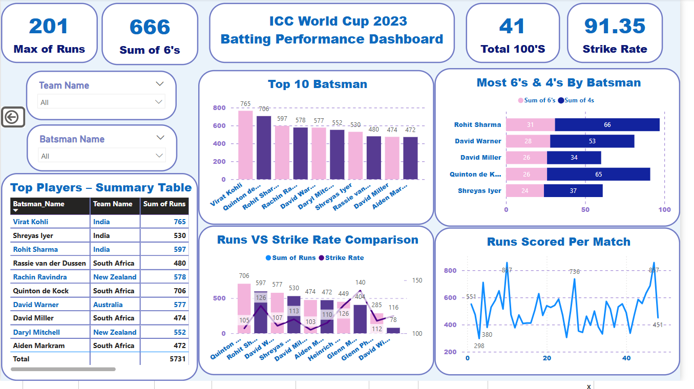
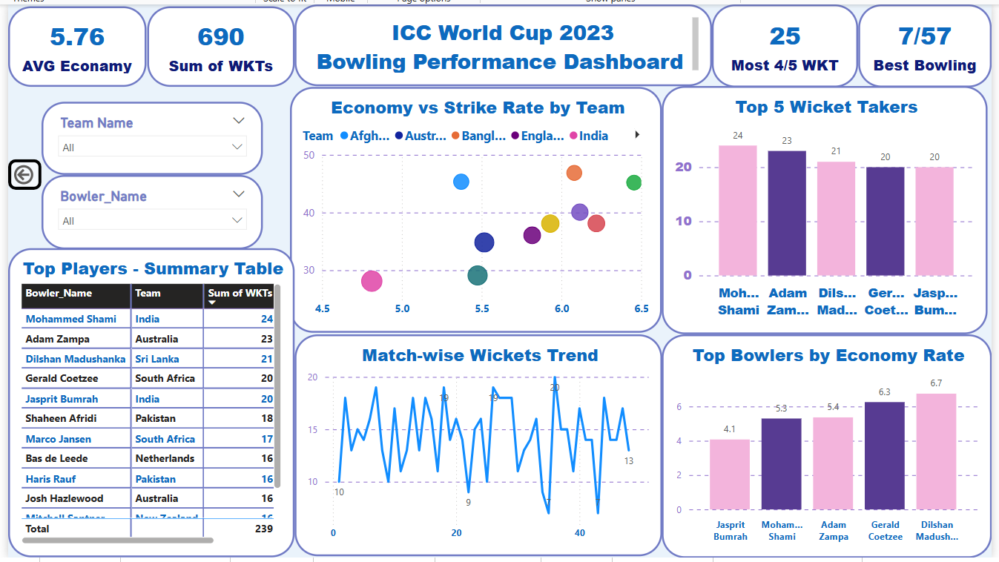

# 🏏 **ICC Cricket World Cup 2023 Power BI Project**

---

## 📌 **Project Summary**
This Power BI dashboard presents a detailed and interactive analysis of the ICC Cricket World Cup 2023. It offers cricket fans and data enthusiasts a clean, interactive platform to explore batting and bowling statistics of top players and teams in the tournament.

---

## 🎯 Project Objectives
- Analyze top batsmen and bowlers of the World Cup.
- Visualize runs, wickets, strike rate, economy, and performance KPIs.
- Provide interactive navigation and user-friendly visuals.
- Enable users to explore individual player performances with ease.

---

## ❓ Problem Statement
Cricket performance data is often unstructured and difficult to analyze quickly. This dashboard solves that problem by:
- Consolidating key data into clean, focused pages.
- Using slicers, cards, and charts for dynamic insights.
- Offering a visually compelling layout that is easy to use and explore.

---

## 📊 Dashboard Structure

### 🏠 1. **Home Page**
- Central title and ICC background theme
- Highlights:
  - 🏆 Trophy visual in the center
  - 📸 Virat Kohli (Top Batsman) with run total
  - 📸 Md. Shami (Top Bowler) with wicket total
- 🔗 Navigation buttons to Batting and Bowling dashboards

---

### 🏏 2. **Batting Dashboard**
- KPIs: Total Runs, Strike Rate, Sixes, Hundreds
- Visuals:
  - Bar chart: Top 10 Run Scorers
  - Scatter plot: Runs vs Strike Rate
- Slicers: Player Name, Team, Opposition

---

### 🎯 3. **Bowling Dashboard**
- KPIs: Wickets, Economy Rate, 4/5 Wicket Hauls
- Visuals:
  - Bar chart: Top Wicket Takers
  - Scatter plot: Economy vs Strike Rate
- Slicers: Bowler Name, Team

---

## 🧠 Key Insights
- 🥇 **Virat Kohli**: Highest run scorer of the tournament.
- 🔥 **Md. Shami**: Dominated bowling charts with maximum wickets and best economy.
- 📈 Aggressive players had high strike rates but required consistency.
- 🧤 Balanced bowling units with low economy had greater match impact.

---

## 🧰 Tools Used
- Microsoft Power BI Desktop
- Power Query Editor for data Cleaning
- DAX for calculated KPIs
- Bookmarks, Buttons & Page Navigation

---

## 🖼️ Dashboard Screenshots

| Home Page | Batting Page | Bowling Page |
|-----------|---------------|----------------|
|  |  |  |

---

## 🎥 Demo Video

📽️  [Watch Project Demo](Icc_Cricket_World_Cup__Project_Video.mp4)

---

## 📁 Files Included

- [ICC_WorldCup2023_Dashboard.pbix ](ICC_WorldCup2023_Dashboard.pbix) – Power BI project file

- [Front_Page.png](Front_page.png) – Front page screenshot

- [Batting_Dashboard.png](Batting_Dashboard.png) – Batting dashboard screenshot

- [Bowling_Dashboard.png](Bowling_Dashboard.png) – Bowling dashboard screenshot

- [ICC_WorldCup_Demo.mp4](Icc_Cricket_World_Cup__Project_Video.mp4) – Demo video walkthrough

---

## 🧭 How to Use
1. Open the [ICC_WorldCup2023_Dashboard.pbix ](ICC_WorldCup2023_Dashboard.pbix) – file in Power BI Desktop.
2. Use navigation buttons on the **Home Page** to switch dashboards.
3. Apply slicers on Batting and Bowling pages for custom analysis.
4. View KPIs and charts for deeper insights.

---

## 📢 Connect
If you like the project, consider giving a ⭐ on the repo or connect on [LinkedIn](https://www.linkedin.com/in/abhishek-thakre13/)!

---

